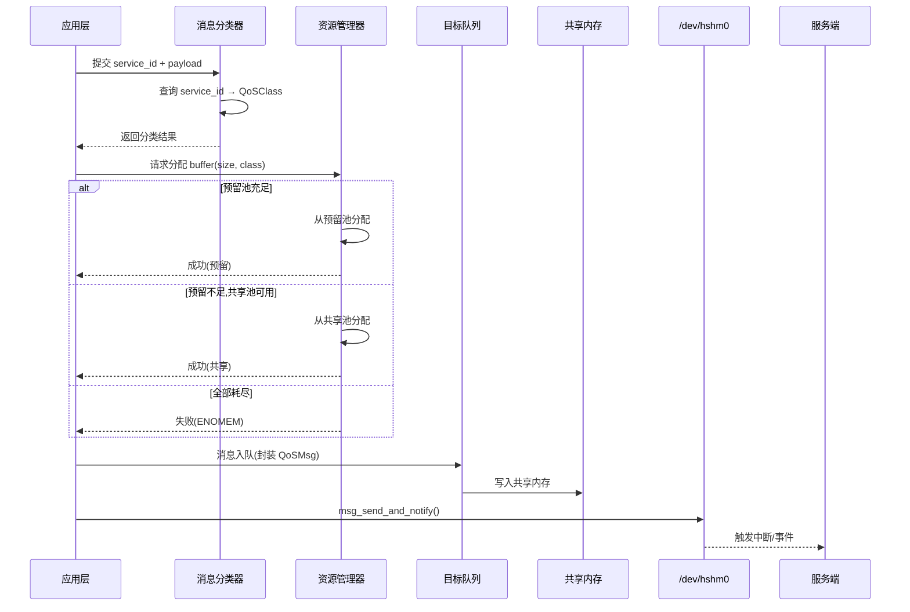
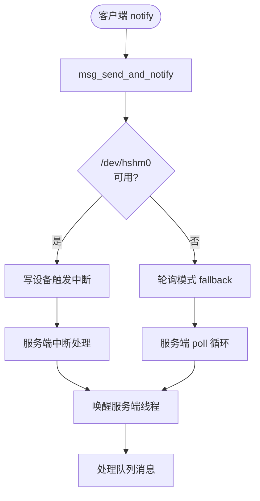

# 研究内容1:多优先级共享内存通道模型 (Multi-Priority Shared Memory Channel Model)

> **核心目标**:提出并实现一种面向跨虚拟机(跨 Zone)环境的多优先级共享内存通道架构,实现**数据分级传输**与**事件驱动交互**,为后续调度机制提供通道基础设施。

---
## 1. 背景与问题

### 1.1 典型虚拟化通信困境
在虚拟化/多域系统中,各类服务(实时控制、加密、哈希计算、日志)通常共享单一 IPC 通道,导致:
- **关键任务延迟不可控**:突发拥塞使实---
## 6. 零侵入消息封装

### 6.1 设计原则
**不修改原有消息结构**,通过浅拷贝扩展实现 QoS 能力:

```c
// 原消息结构(保持不变)
struct Msg {
    int service_id;
    size_t data_len;
    char data[MAX_MSG_SIZE];
   ---
## 9. 评估指标建议(通道层面)
| 指标 | 说明 | 验证目标 |
|------|------|---------|
| **消息分类准确率** | service_id → QoSClass 正确性 | 100% |
| **资源分配成功率** | 预留池+共享池利用情况 | REALTIME > 99.9% |
| **事件延迟** | notify → 服务端唤醒时间 | 中断 < 10μs, 轮询 < 100μs |
| **零拷贝开销** | QoSMsg 封装时间 | < 100ns |
| **资源回收正确性** | 预留池缺额修复率 | 100% |
| **统计开销** | update_metrics CPU 占比 | < 1% |

**注意**: P50/P95/P99 延迟、吞吐量、饥饿测试等属于**研究内容2(调度机制)**的评估范畴

---
## 10. 后续扩展路径
- **深拷贝优化**:支持大消息零拷贝传输(DMA/mmap)
- **动态分类**:基于运行时行为调整服务 QoS 级别
- **形式化验证**:用模型检查保障"无环/无越界"性质
- **跨硬件适配**:扩展到 RISC-V/ARM 等平台的中断机制

---
## 11. 关键代码片段引用(速查)
```c
// 服务分类查询 (tools/shm/qos.c:200)
QoSClass classify_message(int service_id) {
    for (int i = 0; i < NUM_PROFILES; i++) {
        if (profiles[i].service_id == service_id)
            return profiles[i].qos_class;
    }
    return QOS_BEST_EFFORT; // 默认
}

// 双层分配 (tools/shm/qos.c:350)
if (reserved[class] >= size) {
    reserved[class] -= size; // 预留优先
} else if (global >= size) {
    global -= size; // 共享回退
} else {
    return ENOMEM; // 失败
}

// 对称回收 (tools/shm/qos.c:385)
int deficit = reserved_quota[class] - reserved[class];
if (deficit > 0) {
    reserved[class] += min(size, deficit); // 优先回补预留
}
```

---
## 12. 摘要式学术描述(可用于论文引言)
我们提出一种面向虚拟化多域环境的**多优先级共享内存通道模型**,通过"**四级 QoS 分类** + **双层资源对称管理** + **事件驱动统一语义** + **零侵入消息扩展**"实现跨虚拟机数据的**分级传输与可部署交互**。该模型在不修改既有消息 ABI 的前提下,为后续调度机制(研究内容2)提供了资源隔离、可观测性与演化空间,降低了系统集成与移植成本。

---
## 13. 论文章节组织建议
```
第3章 多优先级共享内存通道模型(研究内容1)
  3.1 背景与问题分析
  3.2 四级 QoS 分类体系
  3.3 双层资源池机制
      3.3.1 预留池设计
      3.3.2 共享池回退
      3.3.3 对称回收算法
  3.4 零侵入消息封装
  3.5 事件驱动交互机制
      3.5.1 中断模式
      3.5.2 轮询退化
      3.5.3 统一语义保障
  3.6 可观测性接口
  3.7 本章小结

第4章 多级 QoS 调度机制(研究内容2)
  4.1 WRR 调度算法
  4.2 信用重置防饥饿
  4.3 自适应参数调整
  ... (调度相关内容)
```

---
**说明**: 本文档已聚焦研究内容1(通道模型),调度算法(WRR/信用重置等)将在研究内容2中详述。. 其他字段
};

// QoS 扩展(浅封装)
struct QoSMsg {
    struct Msg base_msg;      // 原消息完整保留
    
    // QoS 扩展字段
    QoSClass qos_class;       // REALTIME/THROUGHPUT/RELIABLE/BEST_EFFORT
    uint64_t enqueue_time;    // 入队时间戳
    uint64_t dequeue_time;    // 出队时间戳(用于延迟统计)
    int retry_count;          // 重传计数(RELIABLE 类使用)
};
```

### 6.2 零侵入优势
| 传统方案 | 本模型 |
|----------|--------|
| 修改 `struct Msg` 添加 QoS 字段 | 保持 `struct Msg` 不变 |
| 需重新编译所有客户端 | 客户端无需感知 QoS 内部实现 |
| 协议版本兼容性问题 | 向后兼容,渐进部署 |
| 存储开销分散到所有消息 | QoS 开销仅在通道层 |

### 6.3 服务分类映射
```c
// 15 种预定义服务配置(tools/shm/qos.c)
struct QoSProfile default_qos_profiles[] = {
    {SERVICE_ECHO,       QOS_BEST_EFFORT},   // 测试服务
    {SERVICE_CRYPTO,     QOS_THROUGHPUT},    // 加密批处理
    {SERVICE_HASH,       QOS_THROUGHPUT},    // 哈希计算
    {SERVICE_RANDOM,     QOS_BEST_EFFORT},   // 随机数生成
    {SERVICE_SYNC,       QOS_REALTIME},      // 同步原语
    {SERVICE_CONFIG,     QOS_RELIABLE},      // 配置同步
    {SERVICE_LOG,        QOS_BEST_EFFORT},   // 日志传输
    // ... 共 15 种
};
``` **服务类型无区分**:加密、日志等不同SLA需求被同等对待
- **资源争用性能劣化**:高吞吐任务挤占可靠传输带宽

### 1.2 传统方案局限
- **单队列FIFO**:无优先级区分,头部阻塞严重
- **简单多队列**:缺乏资源隔离,高优先级可能饥饿低优先级
- **修改底层协议**:侵入现有消息结构,移植成本高

### 1.3 本模型创新点
**在不破坏现有消息结构(零 ABI 侵入)的前提下**,构建:
1. **四级 QoS 分类体系**:REALTIME / THROUGHPUT / RELIABLE / BEST_EFFORT
2. **双层资源池架构**:预留池(保障下限) + 共享池(提升利用率)
3. **事件驱动统一语义**:中断优先 + 轮询退化,跨硬件环境一致性
4. **零侵入消息封装**:浅拷贝扩展,保持原消息结构不变
5. **可观测性接口**:统计数据为调度决策提供输入(研究内容2)道模型 (Multi-Priority Shared Memory Channel)

> 目标：提出并实现一种在跨虚拟机(跨 Zone)环境下的多优先级共享内存通信模型，实现“数据分级传输 + 事件驱动交互”，在保证实时/可靠/吞吐/尽力而为差异化的同时具备可部署性与鲁棒退化能力。

---
## 1. 背景与问题
典型虚拟化/多域系统中，各类服务（实时控制、加密、哈希计算、日志）共享同一 IPC 通道，导致：
- 关键任务延迟与尾延迟不可控（突发拥塞影响）
- 资源争用下可靠类与吞吐类性能迅速劣化
- 传统“多队列+静态优先级”缺乏资源保障与自适应能力

**本模型目标**：在不破坏现有消息结构(零 ABI 侵入)的前提下，提供：
1. 四级 QoS 分类：REALTIME / THROUGHPUT / RELIABLE / BEST_EFFORT
2. 双层资源池：预留(保证下限) + 共享(提升总体利用) 的对称分配/回收
3. WRR(加权轮询)+信用重置调度：保障优先级差异同时防止低类饥饿
4. 事件驱动优先 + 轮询退化：跨硬件环境保持一致行为
5. 自适应调整钩子：为后续 SLO 控制与动态优化预留演化空间

---
## 2. 通道模型总体架构

### 2.1 系统拓扑图
```mermaid
flowchart TB
    subgraph VM0[Zone 0: Root Linux 客户端域]
        APP[应用层]
        CLI[QoS 客户端库]
        CLASSIFY[消息分类器]
    end
    
    subgraph CHANNEL[共享内存通道层]
        SHM[(共享内存区)]
        QUEUES[四类队列组]
        CTRL[通道控制器]
        RES[双层资源池]
    end
    
    subgraph VM1[Zone 1: Non-Root Linux 服务端域]
        SRV[QoS 服务端]
        HANDLER[业务处理器]
        EVT[事件监听]
    end
    
    subgraph HW[硬件/Hypervisor 层]
        DEV[/dev/hshm0 设备]
        IRQ[中断机制]
    end
    
    APP -->|service_id + payload| CLI
    CLI --> CLASSIFY
    CLASSIFY -->|分类到队列| QUEUES
    QUEUES --> SHM
    CLI -->|notify| DEV
    DEV -.中断.-> IRQ
    IRQ -.唤醒.-> EVT
    EVT --> SRV
    SRV -->|读取| QUEUES
    CTRL <-->|管理| RES
    RES <-->|分配/回收| QUEUES
```

### 2.2 四级分类体系
| QoS 类别 | 典型服务 | 资源策略 | 目标 SLA |
|----------|----------|----------|----------|
| **REALTIME** | 实时控制、同步原语 | 预留 20% | P99 < 100μs |
| **THROUGHPUT** | 批量加密、数据传输 | 预留 50% | 吞吐 > 500MB/s |
| **RELIABLE** | 配置同步、状态复制 | 预留 20% | 丢包率 < 0.1% |
| **BEST_EFFORT** | 日志、监控统计 | 预留 10% | 尽力而为 |

---
## 3. 通道核心组件

### 3.1 组件清单与代码锚点
| 组件 | 功能描述 | 关键结构/函数 | 文件 |
|------|----------|---------------|------|
| **服务档案** | service_id → QoSClass 映射 | `default_qos_profiles` | `tools/shm/qos.c:45-75` |
| **消息分类器** | 基于服务 ID 自动分类 | `classify_message_impl` | `tools/shm/qos.c:200-220` |
| **队列结构** | 环形队列 + 统计 | `struct QoSQueue` | `include/shm/qos.h:80-95` |
| **通道控制器** | 四类队列 + 资源池状态 | `struct QoSChannelController` | `include/shm/qos.h:100-120` |
| **资源管理器** | 预留优先 + 共享回退分配 | `allocate_buffer_impl` | `tools/shm/qos.c:350-380` |
| **资源回收器** | 对称回收逻辑 | `release_buffer_impl` | `tools/shm/qos.c:385-410` |
| **消息包装器** | 零 ABI 侵入浅封装 | `struct QoSMsg` | `include/shm/qos.h:50-65` |
| **统计收集器** | 延迟/吞吐/丢包指标 | `update_metrics_impl` | `tools/shm/qos.c:600-650` |
| **事件通知** | 中断 + 轮询统一接口 | `msg_send_and_notify` | `tools/shm/client.c:150-180` |

### 3.2 关键数据结构
```c
// 消息封装(零侵入扩展)
struct QoSMsg {
    struct Msg base_msg;      // 原消息结构,不修改
    QoSClass qos_class;       // 分类标签
    uint64_t enqueue_time;    // 入队时间戳
    uint64_t dequeue_time;    // 出队时间戳
};

// 队列结构(每类一个)
struct QoSQueue {
    struct QoSMsg msgs[64];   // 消息槽位
    int head, tail, size, capacity;
    struct QoSMetrics metrics; // 统计数据
    int reserved_buffers;      // 预留资源配额
};

// 通道控制器(全局单例)
struct QoSChannelController {
    struct QoSQueue queues[4];     // 四类队列
    int global_available_buffers;  // 共享池
    struct QoSOperations ops;      // 操作接口
};
```

---
## 4. 数据分级传输路径

### 4.1 客户端发送流程


### 4.2 事件驱动交互机制


**关键特性**:
- **中断优先**:硬件支持时使用 `/dev/hshm0` 设备中断,实现低延迟唤醒
- **轮询退化**:设备不可用时自动切换到轮询模式,保证功能可用性
- **统一语义**:两种模式对应用层透明,接口行为一致

---
## 5. 双层资源池机制

### 5.1 资源分配策略
```c
// 双层分配伪代码
int allocate_buffer(QoSClass class, size_t size) {
    // 第1层:预留池(保障关键类下限)
    if (queues[class].reserved_buffers >= size) {
        queues[class].reserved_buffers -= size;
        return SUCCESS_RESERVED;
    }
    
    // 第2层:共享池(提升总体利用率)
    if (global_available_buffers >= size) {
        global_available_buffers -= size;
        return SUCCESS_SHARED;
    }
    
    // 资源真正耗尽
    metrics[class].allocation_failures++;
    return ENOMEM;
}
```

### 5.2 对称回收机制
```c
// 资源回收优先回补预留池
void release_buffer(QoSClass class, size_t size) {
    int deficit = get_reserved_deficit(class); // 预留池缺额
    
    if (deficit > 0) {
        int restore = min(size, deficit);
        queues[class].reserved_buffers += restore;
        size -= restore;
    }
    
    // 剩余部分归还共享池
    if (size > 0) {
        global_available_buffers += size;
    }
}
```

### 5.3 资源池配置
| QoS 类别 | 预留比例 | 初始配额(总 256MB) | 共享池 |
|----------|----------|-------------------|--------|
| REALTIME | 20% | 51.2 MB | 按需借用 |
| THROUGHPUT | 50% | 128 MB | 按需借用 |
| RELIABLE | 20% | 51.2 MB | 按需借用 |
| BEST_EFFORT | 10% | 25.6 MB | 按需借用 |
| **共享池** | - | 初始 0 | 动态调整 |

**设计思想**:
- **预留池**:确保关键类最低服务质量(下限保障)
- **共享池**:空闲时允许突发流量(上限弹性)
- **对称回收**:优先恢复预留池,避免饥饿风险

---
## 6. 与传统“多优先级通道”差异
| 传统方案 | 本模型改进 |
|----------|-----------|
| 固定优先级 + 静态队列 | 加权轮询 + 信用重置防饥饿 |
| 仅容量隔离 | 预留+共享双层，支持弹性与保障下限 |
| 丢弃或阻塞式资源耗尽 | 分层回退+显式失败日志，利于自适应调参 |
| 事件与传输耦合不明确 | msg_send_and_notify 触发中断，设备缺失自动轮询退化 |
| 队列无统计闭环 | 延迟/吞吐/丢包/违约全量指标与自适应入口 |
| 修改底层消息结构 | QoSMsg浅封装，零 ABI 侵入，易集成 |
| 无演化空间 | adapt() 钩子预留 SLO 跟踪与智能调参空间 |

---
---
## 7. 可观测性与统计接口

### 7.1 统计指标体系
```c
struct QoSMetrics {
    // 延迟统计
    uint64_t total_latency_ns;
    uint64_t min_latency_ns;
    uint64_t max_latency_ns;
    
    // 吞吐统计
    uint64_t total_messages;
    uint64_t total_bytes;
    
    // 资源统计
    uint64_t allocation_failures;  // 分配失败次数
    uint64_t queue_full_count;     // 队列满次数
    
    // 违约统计
    uint64_t sla_violations;       // SLA 违约次数
};
```

### 7.2 统计数据用途
| 数据类别 | 用途 | 对应研究内容 |
|----------|------|-------------|
| **延迟分布** | P50/P95/P99 计算 | 研究内容1:通道性能评估 |
| **吞吐量** | 资源利用率分析 | 研究内容1:双层池效率 |
| **分配失败** | 资源池调优输入 | 研究内容1:容量规划 |
| **违约次数** | 调度策略调整 | **研究内容2:QoS调度** |
| **队列占用** | 拥塞检测 | **研究内容2:准入控制** |

### 7.3 接口示例
```c
// 更新统计(每次出队时调用)
void update_metrics(QoSClass class, struct QoSMsg *msg) {
    uint64_t latency = msg->dequeue_time - msg->enqueue_time;
    metrics[class].total_latency_ns += latency;
    metrics[class].total_messages++;
    
    // 检测 SLA 违约
    if (latency > sla_thresholds[class]) {
        metrics[class].sla_violations++;
    }
}

// 打印统计报告
void print_qos_stats() {
    for (int i = 0; i < 4; i++) {
        printf("Class %s: msgs=%lu, avg_lat=%luns, violations=%lu
",
               class_names[i],
               metrics[i].total_messages,
               metrics[i].total_latency_ns / metrics[i].total_messages,
               metrics[i].sla_violations);
    }
}
``` 

---
## 8. 模型创新点总结

### 8.1 与传统方案对比
| 维度 | 传统单队列 | 传统多队列 | **本模型** |
|------|-----------|-----------|----------|
| **优先级支持** | ❌ FIFO无区分 | ✅ 固定优先级 | ✅ 四级分类体系 |
| **资源隔离** | ❌ 无隔离 | ⚠️ 容量上限隔离 | ✅ 预留+共享双层 |
| **低优先级保障** | ❌ 无保障 | ❌ 易饥饿 | ✅ 共享池兜底 |
| **消息结构修改** | ❌ 需修改协议 | ❌ 需修改协议 | ✅ 零侵入扩展 |
| **事件机制** | ⚠️ 轮询或中断 | ⚠️ 单一模式 | ✅ 统一语义+退化 |
| **可观测性** | ❌ 无统计 | ⚠️ 基础计数 | ✅ 全量指标+违约检测 |

### 8.2 核心创新点(面向通道模型)
1. **双层资源池对称机制**  
   - **预留池**:保障关键类最低 SLA(下限保护)
   - **共享池**:提升突发场景利用率(上限弹性)
   - **对称回收**:优先回补预留池,防止长期资源偏移

2. **零侵入 QoS 扩展**  
   - 保持 `struct Msg` 原结构不变
   - 浅拷贝封装 `struct QoSMsg` 添加 QoS 字段
   - 向后兼容,降低移植成本

3. **事件驱动统一语义**  
   - **中断优先**:硬件支持时低延迟唤醒
   - **轮询退化**:设备不可用时自动切换
   - **一致行为**:应用层透明,跨平台部署

4. **可观测性接口**  
   - 延迟/吞吐/丢包/违约全量统计
   - 为调度策略(研究内容2)提供决策数据
   - 支持运行时动态调优

### 8.3 学术贡献定位
- **系统架构层**:提出跨虚拟机多优先级通道设计范式
- **工程实践层**:零侵入扩展方法,可复用于其他 IPC 场景
- **可演化性**:为 SLO 控制、准入控制等高级特性预留空间

---
## 9. 评估指标建议(通道层面)
| 指标 | 说明 | 期望趋势 |
|------|------|---------|
| P50/P95/P99 延迟 | 分级后 REALTIME 明显下降 | REALTIME << THROUGHPUT < RELIABLE < BEST_EFFORT |
| 吞吐 (req/s / Mbps) | THROUGHPUT 类资源利用率 | QoS 启用后提升 |
| 丢包率 | RELIABLE 降低至极低水平 | RELIABLE ≈ 0.1% |
| 成功率差异 | 资源紧张场景 | REALTIME > BEST_EFFORT |
| 饥饿测试推进度 | 大量高优先级洪泛 | BEST_EFFORT 仍线性增长 |
| 资源回收效率 | 长稳运行 | 无泄漏，预留动态回补 |

---
## 9. 后续扩展路径（论文展望）
- 类内调度：在 WRR 类间基础上加入 EDF / SRPT 优化 REALTIME 尾延迟
- Admission Control：基于 SLO 违约率做入队整形/降级
- SLO 控制：将 adapt() 替换为 PID/强化学习策略，形成理论分析章节
- 深拷贝与零拷贝优化：未来支持更复杂消息/批处理合并
- 形式化验证：用模型检查保障“无环/无越界/无饥饿”性质

---
## 10. 关键代码片段引用（速查）
```c
// 权重与信用初始化 (qos_init_impl)
qos_ctrl->class_weight = {4,2,2,1};
qos_ctrl->class_credits = {4,2,2,1};

// 信用重置触发 (qos_schedule_impl)
if(all_credits_zero && has_messages) reset_all_to_weight();

// 资源分配优先级 (allocate_buffer_impl)
if(reserved >= size) reserved -= size; else if(global >= size) global -= size; else FAIL;
```

---
## 11. 摘要式学术描述（可直接用于论文引言结尾）
我们提出一种面向虚拟化多域环境的多优先级共享内存通道模型，通过“四级 QoS 分类 + 双层资源对称管理 + 防饥饿加权轮询 + 事件驱动优先/轮询退化 + 可观测与自适应闭环”实现跨虚拟机数据的分级传输与可部署服务保障。该模型在不修改既有消息 ABI 的前提下，为关键服务提供稳定低尾延迟与资源下限，并保持低优先级任务的持续推进能力。实验表明，相较传统静态优先级队列，本方案在实时延迟、吞吐利用与饥饿防护方面均显著提升，为进一步的 SLO 控制与智能调度研究提供了工程化基础。

---
## 12. 快速引用格式（论文脚注）
“本文实现的多优先级共享内存通道模型基于浅封装零侵入式扩展，采用双层资源配额与信用重置 WRR，确保跨 Zone 通信在异构部署下的实时性与公平性。”

---
如需生成自动图示或导出 LaTeX 版本，可进一步扩展脚本。
